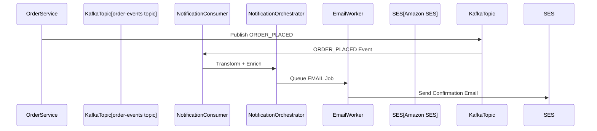

Designing a **Notification Service at Scale** requires careful planning around both functional and non-functional requirements. Below are the **functional requirements** typically involved in such a system:

---

### ✅ **Core Functional Requirements**

1. **Send Notifications**

   * Send notifications to users via multiple channels:

     * Email
     * SMS
     * Push (mobile, web)
     * In-app
     * WhatsApp (if applicable)

2. **Multi-Channel Support**

   * Ability to configure and send a notification via one or more channels based on:

     * User preferences
     * Notification type
     * Fallback strategy (e.g., SMS if push fails)

3. **Notification Templates**

   * Support for creating and managing templates with placeholders
   * Personalization using user data
   * Versioning of templates

4. **User Preferences Management**

   * Users can opt-in/out of:

     * Certain channels (e.g., email only)
     * Certain categories (e.g., marketing vs transactional)
     * Specific times for non-urgent notifications

5. **Notification Scheduling**

   * Support immediate, delayed, or scheduled delivery
   * Timezone-aware scheduling

6. **Bulk Notifications**

   * Ability to send broadcast or batch notifications to large user groups (e.g., marketing campaigns, announcements)

7. **Retry Mechanism**

   * Automatic retries in case of transient failures (e.g., third-party SMS gateway is down)
   * Exponential backoff, retry limits

8. **Idempotency & Deduplication**

   * Prevent duplicate notifications due to retry logic or system errors

9. **Notification History / Logs**

   * Maintain delivery status (sent, failed, read)
   * Track each notification's lifecycle for a user
   * Provide audit logs for debugging/troubleshooting

10. **Read Receipts & Click Tracking (where applicable)**

    * For push or in-app, track if the user opened the notification
    * For email or SMS, track clicks (if URLs are provided)

11. **API for Internal Services**

    * Internal services can trigger a notification by calling the API
    * Payload: recipient, type, dynamic content

12. **Localization**

    * Support sending messages in the user’s preferred language

13. **Rate Limiting & Throttling**

    * Prevent abuse by limiting messages per user per time window

14. **Quarantine & Blacklist Management**

    * Temporarily or permanently block sending to certain users due to bounce/unsubscribe/spam complaints

---

### ✅ **Optional Advanced Features**

1. **A/B Testing**

   * Test different versions of notification content to measure engagement

2. **Priority Queuing**

   * Prioritize transactional notifications over promotional ones

3. **Event-Driven Triggering**

   * Listen to events from other services (e.g., order placed, password changed) and send relevant notifications

4. **Dashboard / Admin Panel**

   * UI to monitor, schedule, manage templates, view analytics

5. **Multitenancy Support**

   * For SaaS applications, isolate notifications and settings per tenant

6. **Mobile Push Token Management**

   * Register/unregister device tokens
   * Handle invalid/expired tokens

------------------------------------------------------------------
Great! Let’s dive into these areas one by one. We'll start with the **Tech Stack and Component Diagram**, then move on to the **Database Schema**, **Sample API Contract**, and finally the **Event-Driven Architecture Design**.

---

## 1️⃣ **Tech Stack & Component Diagram**

### ✅ **Recommended Tech Stack (Cloud-Agnostic)**

| Layer/Component        | Suggested Technology Options                                              |
| ---------------------- | ------------------------------------------------------------------------- |
| API Gateway            | NGINX, Kong, AWS API Gateway, Azure API Management                        |
| Backend Service        | Node.js / Java / Go / Python (Spring Boot is solid for Java)              |
| Message Queue          | Apache Kafka / RabbitMQ / AWS SQS / GCP Pub/Sub                           |
| Task Scheduler         | Celery (Python), Quartz (Java), Temporal, BullMQ (Node.js)                |
| Database               | PostgreSQL / MySQL for core data                                          |
| NoSQL Store (Optional) | Redis / DynamoDB for fast read cache or ephemeral data                    |
| Notification Providers | Twilio (SMS), Firebase (Push), SES (Email), OneSignal, WhatsApp Cloud API |
| Template Storage       | S3 / Cloud Storage / DB-based                                             |
| Observability          | Prometheus + Grafana, ELK Stack, Sentry                                   |
| CI/CD & Infra          | GitHub Actions / Jenkins + Docker + Kubernetes + Helm                     |
| Authentication         | OAuth 2.0 / JWT / Internal Identity Provider                              |

---

### ✅ **High-Level Component Diagram**

```
                        +--------------------+
                        |     Client Apps    |
                        | (Web, Mobile, APIs)|
                        +---------+----------+
                                  |
                       +----------v-----------+
                       |    API Gateway       |
                       +----------+-----------+
                                  |
               +------------------v-------------------+
               |     Notification Service API         |
               | (REST Controller / GraphQL Gateway)  |
               +------------------+-------------------+
                                  |
            +---------------------v---------------------+
            |         Notification Orchestrator         |
            | - Validates request                       |
            | - Fetches user/channel preferences        |
            | - Resolves templates                      |
            | - Schedules or routes the job             |
            +----------+--------------+-----------------+
                       |              |
         +-------------v----+     +---v----------------+
         |  Template Engine  |     | Scheduler/Worker  |
         +------------------+     +--------------------+
                                         |
                            +------------v-------------+
                            |  Message Queue (Kafka/SQS)|
                            +------------+-------------+
                                         |
                              +----------v---------+
                              |  Channel Dispatcher |
                              | (Email, SMS, Push)  |
                              +----------+----------+
                                         |
                   +---------------------v-------------------+
                   |  External Providers (SES, Twilio, FCM)  |
                   +-----------------------------------------+

                             ⬇️ (Side Channels)
               +------------------------------------------+
               | DB (PostgreSQL) - Logs, Templates, Users |
               | Redis - Token cache, Rate limit, Flags   |
               +------------------------------------------+

```


------------------------------------------------------------------
Perfect — let's now dive into the **Database Schema** design for a scalable notification service.

---

## 2️⃣ **Database Schema for Notification Service**

This schema will support:

* Multi-channel notifications (email, SMS, push, etc.)
* Template management
* User preferences
* Tracking delivery status
* Scheduling

---

### ✅ **Core Tables**

---

### 📄 `users`

| Column Name    | Type      | Description                      |
| -------------- | --------- | -------------------------------- |
| `user_id`      | UUID (PK) | Unique identifier                |
| `email`        | VARCHAR   | User email                       |
| `phone_number` | VARCHAR   | User phone number (E.164 format) |
| `device_token` | VARCHAR   | For push notifications           |
| `locale`       | VARCHAR   | User’s language preference       |
| `timezone`     | VARCHAR   | User’s timezone                  |

---

### 📄 `notification_templates`

| Column Name   | Type      | Description                             |
| ------------- | --------- | --------------------------------------- |
| `template_id` | UUID (PK) | Template unique ID                      |
| `name`        | VARCHAR   | Template name (e.g., `ORDER_CONFIRMED`) |
| `channel`     | ENUM      | `EMAIL`, `SMS`, `PUSH`, `IN_APP`        |
| `language`    | VARCHAR   | Template language (e.g., `en`, `hi`)    |
| `subject`     | TEXT      | Email subject / push title              |
| `content`     | TEXT      | Body of the message with placeholders   |
| `created_at`  | TIMESTAMP | Created time                            |
| `updated_at`  | TIMESTAMP | Last updated                            |

---

### 📄 `user_preferences`

| Column Name            | Type      | Description                           |
| ---------------------- | --------- | ------------------------------------- |
| `user_id`              | UUID (FK) | Refers to `users.user_id`             |
| `channel`              | ENUM      | `EMAIL`, `SMS`, `PUSH`, etc.          |
| `category`             | VARCHAR   | `TRANSACTIONAL`, `MARKETING`, etc.    |
| `is_enabled`           | BOOLEAN   | Whether user has opted in             |
| `do_not_disturb`       | BOOLEAN   | True if user doesn’t want after hours |
| `preferred_time_start` | TIME      | Optional time window for messages     |
| `preferred_time_end`   | TIME      | Optional time window for messages     |

---

### 📄 `notifications`

| Column Name       | Type      | Description                           |
| ----------------- | --------- | ------------------------------------- |
| `notification_id` | UUID (PK) | Unique ID                             |
| `user_id`         | UUID (FK) | Recipient                             |
| `template_id`     | UUID (FK) | Template used                         |
| `channel`         | ENUM      | `EMAIL`, `SMS`, etc.                  |
| `payload`         | JSONB     | Merged dynamic values used            |
| `status`          | ENUM      | `SCHEDULED`, `SENT`, `FAILED`, `READ` |
| `scheduled_at`    | TIMESTAMP | If delayed or future send             |
| `sent_at`         | TIMESTAMP | When it was dispatched                |
| `read_at`         | TIMESTAMP | (Push/In-app) When user interacted    |
| `retry_count`     | INT       | Retries attempted                     |
| `error_log`       | TEXT      | Optional error if failed              |

---

### 📄 `notification_events`

| Column Name       | Type      | Description                                      |
| ----------------- | --------- | ------------------------------------------------ |
| `event_id`        | UUID (PK) | Unique ID                                        |
| `notification_id` | UUID (FK) | Refers to `notifications.notification_id`        |
| `event_type`      | VARCHAR   | `SENT`, `DELIVERED`, `FAILED`, `CLICKED`, `READ` |
| `timestamp`       | TIMESTAMP | When event occurred                              |
| `metadata`        | JSONB     | Additional info (provider ID, bounce reason)     |

---

### 📄 `channel_configs` (Optional — for dynamic routing)

| Column Name   | Type    | Description                 |
| ------------- | ------- | --------------------------- |
| `channel`     | ENUM    | Email, SMS, etc.            |
| `provider`    | VARCHAR | e.g., `Twilio`, `Sendgrid`  |
| `config_json` | JSONB   | API keys, rate limits, etc. |
| `priority`    | INT     | Provider selection priority |

---

### Relationships

* A `user` can have many `notifications`
* A `notification` is based on a `template`
* A `notification` can have multiple `events`
* `user_preferences` helps route & filter messages
* `channel_configs` can be updated without changing code

---

### Example ER Diagram (Text Representation)

```
users ─────┬────────> user_preferences
           ├────────> notifications ─────> notification_events
           └────────> (via FK) notification_templates

notification_templates ───────────┬──────> notifications
                                  └──────> channels (provider-specific)
```

---

### ⚙️ Scaling Tips

* Use **partitioning** on `notifications` by `scheduled_at` or `user_id`
* Use **indexing** on `status`, `user_id`, `channel`, `scheduled_at`
* Archive old `notifications` to cold storage
* Redis can be used for rate limiting, DND flags, or token caching


------------------------------------------------------------------
Great — now let’s move to the **Sample API Contract** for the Notification Service.

---

## 3️⃣ **Sample API Contract (REST)**

We'll focus on the key endpoints required for triggering, managing, and querying notifications.

---

### ✅ 1. **Send Notification**

**POST** `/api/v1/notifications/send`

#### **Request Body**

```json
{
  "user_id": "4f34eac0-d0a1-42fd-b1a2-df32e1fa57e5",
  "template_name": "ORDER_CONFIRMATION",
  "channel": ["EMAIL", "PUSH"],
  "language": "en",
  "schedule_at": "2025-08-02T14:00:00Z",  // optional
  "data": {
    "user_name": "John",
    "order_id": "ORD123456",
    "delivery_date": "2025-08-05"
  }
}
```

#### **Response**

```json
{
  "notification_id": "90c31c4d-e431-476b-9677-94cf105f6b25",
  "status": "SCHEDULED"
}
```

---

### ✅ 2. **Get Notification Status**

**GET** `/api/v1/notifications/{notification_id}`

#### **Response**

```json
{
  "notification_id": "90c31c4d-e431-476b-9677-94cf105f6b25",
  "status": "SENT",
  "channel": "EMAIL",
  "sent_at": "2025-08-02T14:02:10Z",
  "read_at": null,
  "error_log": null
}
```

---

### ✅ 3. **Bulk/Broadcast Notification**

**POST** `/api/v1/notifications/broadcast`

#### **Request Body**

```json
{
  "template_name": "SYSTEM_MAINTENANCE",
  "channel": ["PUSH"],
  "language": "en",
  "filter": {
    "user_segment": "ALL_USERS"
  },
  "data": {
    "message": "Scheduled maintenance on 5th Aug at 2AM."
  }
}
```

#### **Response**

```json
{
  "broadcast_id": "ad572ff2-a12f-42d3-8aef-e6e16ad07c73",
  "total_scheduled": 300000
}
```

---

### ✅ 4. **Manage Templates**

#### Create Template

**POST** `/api/v1/templates`

```json
{
  "name": "ORDER_CONFIRMATION",
  "channel": "EMAIL",
  "language": "en",
  "subject": "Your order {{order_id}} has been confirmed!",
  "content": "Hi {{user_name}}, your order {{order_id}} will be delivered by {{delivery_date}}."
}
```

#### Fetch Template

**GET** `/api/v1/templates/{template_id}`

---

### ✅ 5. **Manage User Preferences**

#### Update Preferences

**PUT** `/api/v1/users/{user_id}/preferences`

```json
{
  "preferences": [
    {
      "channel": "SMS",
      "category": "MARKETING",
      "is_enabled": false
    },
    {
      "channel": "EMAIL",
      "category": "TRANSACTIONAL",
      "is_enabled": true
    }
  ]
}
```

#### Get Preferences

**GET** `/api/v1/users/{user_id}/preferences`

---

### ✅ 6. **Track Notification Events (via Webhook or Polling)**

#### Provider posts back event

**POST** `/api/v1/notifications/event`

```json
{
  "provider_message_id": "abc-123",
  "notification_id": "90c31c4d-e431-476b-9677-94cf105f6b25",
  "event_type": "DELIVERED",
  "timestamp": "2025-08-02T14:05:10Z",
  "metadata": {
    "status_code": 200
  }
}
```

---

### Optional Headers

* `X-Request-ID` for traceability
* `Authorization: Bearer <token>` for internal or secure routes


------------------------------------------------------------------
Excellent — let’s now explore **Event-Driven Architecture Design** and then move on to implement the **OpenAPI (Swagger)** specification.

---

## 4️⃣ **Event-Driven Architecture Design**

To build a scalable, decoupled notification system, we use events to trigger notifications rather than tightly coupling business services (like order, payment, etc.) with notification logic.

---

### ✅ **Core Components**

1. **Event Producer Services**
   e.g., Order Service, Payment Service, Auth Service

   * These services publish events like `ORDER_PLACED`, `PAYMENT_SUCCESS`, `PASSWORD_RESET`

2. **Message Broker**

   * Kafka / RabbitMQ / AWS SNS+SQS / GCP PubSub
   * Delivers messages to multiple consumers reliably

3. **Notification Event Listener**

   * Subscribes to relevant topics
   * Processes event payloads
   * Maps event to notification templates + recipients

4. **Notification Orchestrator**

   * Fetches template
   * Resolves user preferences
   * Pushes tasks into channel-specific queues

5. **Channel Workers (Async)**

   * Email Worker → SES, SendGrid
   * SMS Worker → Twilio, Nexmo
   * Push Worker → FCM, APNs

---

### ✅ **Flow Example: ORDER\_PLACED**



---

### ✅ **Topics and Events**

| Topic Name         | Sample Events                         |
| ------------------ | ------------------------------------- |
| `user-events`      | `USER_REGISTERED`, `PASSWORD_RESET`   |
| `order-events`     | `ORDER_PLACED`, `ORDER_SHIPPED`       |
| `payment-events`   | `PAYMENT_SUCCESS`, `REFUND_INITIATED` |
| `marketing-events` | `PROMOTION_AVAILABLE`, `NEWSLETTER`   |

---

### ✅ **Best Practices**

* Use **schema registry** (e.g., Avro + Confluent) for contract enforcement
* Events should be **immutable**
* Each event should carry enough context (user ID, metadata)
* Use **dead-letter queues (DLQs)** for failures
* Support **retry logic** via backoff queues

---

## ✅ 5️⃣ **OpenAPI (Swagger) Specification**

Let’s implement OpenAPI 3.0 spec for the `/notifications/send` endpoint.

---

### 📘 `/notifications/send` – OpenAPI 3.0

```yaml
openapi: 3.0.3
info:
  title: Notification Service API
  version: 1.0.0
paths:
  /api/v1/notifications/send:
    post:
      summary: Send a notification to a user
      tags:
        - Notifications
      requestBody:
        required: true
        content:
          application/json:
            schema:
              type: object
              required:
                - user_id
                - template_name
                - channel
                - data
              properties:
                user_id:
                  type: string
                  format: uuid
                template_name:
                  type: string
                  example: ORDER_CONFIRMATION
                channel:
                  type: array
                  items:
                    type: string
                    enum: [EMAIL, SMS, PUSH, IN_APP]
                language:
                  type: string
                  example: en
                schedule_at:
                  type: string
                  format: date-time
                  description: Optional scheduled timestamp
                data:
                  type: object
                  description: Key-value map of dynamic fields
                  additionalProperties:
                    type: string
      responses:
        '200':
          description: Notification accepted
          content:
            application/json:
              schema:
                type: object
                properties:
                  notification_id:
                    type: string
                    format: uuid
                  status:
                    type: string
                    enum: [SCHEDULED, SENT, FAILED]
        '400':
          description: Invalid input
        '500':
          description: Internal error
```

------------------------------------------------------------------
Here is the **full OpenAPI 3.0 specification** for your Notification Service, including endpoints for:

* Sending a notification (`/notifications/send`)
* Templates (`/templates`)
* User preferences (`/users/{user_id}/preferences`)
* Notification status lookup (`/notifications/{id}`)

---

## 📘 Full OpenAPI 3.0 Spec (YAML)

```yaml
openapi: 3.0.3
info:
  title: Notification Service API
  version: 1.0.0
  description: API for managing notifications, templates, and user preferences.

servers:
  - url: https://api.notification-service.com

paths:
  /api/v1/notifications/send:
    post:
      summary: Send a notification to a user
      tags:
        - Notifications
      requestBody:
        required: true
        content:
          application/json:
            schema:
              $ref: '#/components/schemas/SendNotificationRequest'
      responses:
        '200':
          description: Notification accepted
          content:
            application/json:
              schema:
                $ref: '#/components/schemas/SendNotificationResponse'

  /api/v1/notifications/{notification_id}:
    get:
      summary: Get notification status
      tags:
        - Notifications
      parameters:
        - in: path
          name: notification_id
          required: true
          schema:
            type: string
            format: uuid
      responses:
        '200':
          description: Notification status
          content:
            application/json:
              schema:
                $ref: '#/components/schemas/NotificationStatus'

  /api/v1/templates:
    post:
      summary: Create a new template
      tags:
        - Templates
      requestBody:
        required: true
        content:
          application/json:
            schema:
              $ref: '#/components/schemas/CreateTemplateRequest'
      responses:
        '201':
          description: Template created
          content:
            application/json:
              schema:
                $ref: '#/components/schemas/TemplateResponse'

  /api/v1/templates/{template_id}:
    get:
      summary: Get a template
      tags:
        - Templates
      parameters:
        - in: path
          name: template_id
          required: true
          schema:
            type: string
            format: uuid
      responses:
        '200':
          description: Template data
          content:
            application/json:
              schema:
                $ref: '#/components/schemas/TemplateResponse'

  /api/v1/users/{user_id}/preferences:
    get:
      summary: Get user notification preferences
      tags:
        - Preferences
      parameters:
        - in: path
          name: user_id
          required: true
          schema:
            type: string
            format: uuid
      responses:
        '200':
          description: User preferences
          content:
            application/json:
              schema:
                $ref: '#/components/schemas/UserPreferences'

    put:
      summary: Update user notification preferences
      tags:
        - Preferences
      parameters:
        - in: path
          name: user_id
          required: true
          schema:
            type: string
            format: uuid
      requestBody:
        required: true
        content:
          application/json:
            schema:
              $ref: '#/components/schemas/UpdateUserPreferencesRequest'
      responses:
        '200':
          description: Preferences updated
          content:
            application/json:
              schema:
                $ref: '#/components/schemas/UserPreferences'

components:
  schemas:
    SendNotificationRequest:
      type: object
      required:
        - user_id
        - template_name
        - channel
        - data
      properties:
        user_id:
          type: string
          format: uuid
        template_name:
          type: string
        channel:
          type: array
          items:
            type: string
            enum: [EMAIL, SMS, PUSH, IN_APP]
        language:
          type: string
          example: en
        schedule_at:
          type: string
          format: date-time
        data:
          type: object
          additionalProperties:
            type: string

    SendNotificationResponse:
      type: object
      properties:
        notification_id:
          type: string
          format: uuid
        status:
          type: string
          enum: [SCHEDULED, SENT, FAILED]

    NotificationStatus:
      type: object
      properties:
        notification_id:
          type: string
          format: uuid
        status:
          type: string
          enum: [SENT, SCHEDULED, FAILED, READ]
        channel:
          type: string
        sent_at:
          type: string
          format: date-time
        read_at:
          type: string
          format: date-time
          nullable: true
        error_log:
          type: string
          nullable: true

    CreateTemplateRequest:
      type: object
      required:
        - name
        - channel
        - language
        - subject
        - content
      properties:
        name:
          type: string
        channel:
          type: string
          enum: [EMAIL, SMS, PUSH, IN_APP]
        language:
          type: string
        subject:
          type: string
        content:
          type: string

    TemplateResponse:
      type: object
      properties:
        template_id:
          type: string
          format: uuid
        name:
          type: string
        channel:
          type: string
        language:
          type: string
        subject:
          type: string
        content:
          type: string
        created_at:
          type: string
          format: date-time
        updated_at:
          type: string
          format: date-time

    UserPreferences:
      type: object
      properties:
        user_id:
          type: string
        preferences:
          type: array
          items:
            type: object
            properties:
              channel:
                type: string
                enum: [EMAIL, SMS, PUSH, IN_APP]
              category:
                type: string
              is_enabled:
                type: boolean
              do_not_disturb:
                type: boolean
              preferred_time_start:
                type: string
                format: time
              preferred_time_end:
                type: string
                format: time

    UpdateUserPreferencesRequest:
      type: object
      required: [preferences]
      properties:
        preferences:
          type: array
          items:
            type: object
            required: [channel, category, is_enabled]
            properties:
              channel:
                type: string
              category:
                type: string
              is_enabled:
                type: boolean
              do_not_disturb:
                type: boolean
              preferred_time_start:
                type: string
                format: time
              preferred_time_end:
                type: string
                format: time
```

------------------------------------------------------------------
Perfect — now that you're transitioning into **LLD (Low-Level Design)** using **Java + Spring Boot**, let's start by listing all **Entities (JPA models)** required to support the high-level design (HDL) we've already discussed.

---

## ✅ Core Entities Required

These are the domain entities you'd typically define as `@Entity` classes for your Notification Service:

---

### 1. **User**

```java
@Entity
public class User {
    @Id
    private UUID userId;

    private String email;
    private String phoneNumber;
    private String deviceToken;
    private String locale;
    private String timezone;
}
```

---

### 2. **NotificationTemplate**

```java
@Entity
public class NotificationTemplate {
    @Id
    private UUID templateId;

    private String name;

    @Enumerated(EnumType.STRING)
    private ChannelType channel;

    private String language;
    private String subject;
    
    @Lob
    private String content;

    private LocalDateTime createdAt;
    private LocalDateTime updatedAt;
}
```

---

### 3. **UserPreference**

```java
@Entity
public class UserPreference {
    @Id
    @GeneratedValue
    private Long id;

    @ManyToOne
    private User user;

    @Enumerated(EnumType.STRING)
    private ChannelType channel;

    private String category; // e.g. MARKETING, TRANSACTIONAL
    private boolean isEnabled;
    private boolean doNotDisturb;

    private LocalTime preferredTimeStart;
    private LocalTime preferredTimeEnd;
}
```

---

### 4. **Notification**

```java
@Entity
public class Notification {
    @Id
    private UUID notificationId;

    @ManyToOne
    private User user;

    @ManyToOne
    private NotificationTemplate template;

    @Enumerated(EnumType.STRING)
    private ChannelType channel;

    @Lob
    @Convert(converter = JsonConverter.class)
    private Map<String, String> payload;

    @Enumerated(EnumType.STRING)
    private NotificationStatus status;

    private LocalDateTime scheduledAt;
    private LocalDateTime sentAt;
    private LocalDateTime readAt;

    private int retryCount;

    @Lob
    private String errorLog;
}
```

---

### 5. **NotificationEvent**

```java
@Entity
public class NotificationEvent {
    @Id
    @GeneratedValue
    private Long eventId;

    @ManyToOne
    private Notification notification;

    private String eventType; // e.g. SENT, FAILED, READ, CLICKED
    private LocalDateTime timestamp;

    @Lob
    @Convert(converter = JsonConverter.class)
    private Map<String, Object> metadata;
}
```

---

### 6. **ChannelConfig** *(optional, if you want dynamic routing)*

```java
@Entity
public class ChannelConfig {
    @Id
    @GeneratedValue
    private Long id;

    @Enumerated(EnumType.STRING)
    private ChannelType channel;

    private String provider;

    @Lob
    @Convert(converter = JsonConverter.class)
    private Map<String, Object> configJson;

    private Integer priority;
}
```

---

### ✅ Enum Classes Required

```java
public enum ChannelType {
    EMAIL, SMS, PUSH, IN_APP
}

public enum NotificationStatus {
    SCHEDULED, SENT, FAILED, READ
}
```

---

### ✅ Utility: JSON Converter

For persisting JSON fields (`payload`, `metadata`, etc.):

```java
@Converter
public class JsonConverter implements AttributeConverter<Object, String> {
    private static final ObjectMapper objectMapper = new ObjectMapper();

    @Override
    public String convertToDatabaseColumn(Object attribute) {
        try {
            return objectMapper.writeValueAsString(attribute);
        } catch (JsonProcessingException e) {
            throw new RuntimeException("JSON serialization failed", e);
        }
    }

    @Override
    public Object convertToEntityAttribute(String dbData) {
        try {
            return objectMapper.readValue(dbData, new TypeReference<Map<String, Object>>() {});
        } catch (IOException e) {
            throw new RuntimeException("JSON deserialization failed", e);
        }
    }
}
```

------------------------------------------------------------------
Excellent choice — splitting into **Bounded Contexts** ensures modularity, scalability, and clear team ownership. Here's how we can split the **Notification Service** into **domain-driven bounded contexts**, each with its own microservice (or module if you're building a monolith with modular architecture).

---

## ✅ Bounded Contexts for Notification System

| Context Name                 | Responsibility                                              | Tech/Service Layer |
| ---------------------------- | ----------------------------------------------------------- | ------------------ |
| **User Preference Service**  | Manage user opt-ins, DND, categories, channel settings      | REST API + DB      |
| **Template Service**         | Manage multilingual notification templates per channel      | REST API + DB      |
| **Notification API Gateway** | Accept external/internal API calls to trigger notifications | REST Controller    |
| **Event Processor Service**  | Listen to Kafka events and convert them into jobs           | Kafka Consumer     |
| **Orchestration Service**    | Merge data, fetch preferences, schedule notification jobs   | Business logic     |
| **Dispatcher Service**       | Channel-specific execution (e.g., call SES, Twilio, FCM)    | Async Worker       |
| **Tracking & Analytics**     | Store events (SENT, READ, etc.), track delivery & failures  | DB + Webhooks      |

---

## 📦 1. **User Preference Service**

* **Responsibility**: Manages `user_preferences` table
* **Exposes**:

  * `GET /users/{id}/preferences`
  * `PUT /users/{id}/preferences`
* **Shared Entity**: `UserPreference`
* **Database**: Can be shared or separate
* **Optional Enhancements**:

  * Use Redis cache for real-time decisions

---

## 📦 2. **Template Service**

* **Responsibility**: CRUD operations on templates
* **Exposes**:

  * `POST /templates`
  * `GET /templates/{id}`
  * `GET /templates/search?name=ORDER_PLACED&channel=EMAIL&lang=en`
* **Shared Entity**: `NotificationTemplate`
* **Templating Engine**: Apache Velocity / FreeMarker / Thymeleaf
* **Scaling Strategy**: Cache commonly used templates

---

## 📦 3. **Notification API Gateway**

* **Responsibility**: Entry point for triggering notifications via REST
* **Routes**:

  * `POST /notifications/send`
  * `POST /notifications/broadcast`
* **Validation & Auth**: User ID, template, schedule\_at, payload
* **Forwards** to: Orchestration Service or Kafka topic

---

## 📦 4. **Event Processor Service**

* **Responsibility**: Listens to topics like `user-events`, `order-events`
* **Functionality**:

  * Subscribe to Kafka/RabbitMQ
  * Parse event (`ORDER_PLACED`)
  * Map to a template
  * Pass event → Orchestrator

---

## 📦 5. **Orchestration Service**

* **Responsibility**:

  * Fetch template from Template Service
  * Get preferences from User Preference Service
  * Render the template with payload
  * Schedule notification job (to Kafka queue or DB)
* **Entity Used**: `Notification`
* **Business Rules**:

  * Respect DND, user timezones
  * Retry logic

---

## 📦 6. **Dispatcher Service**

* **Responsibility**: Dequeues jobs from queue and sends messages
* **Implementation**:

  * Kafka/RabbitMQ Consumer
  * Channel-specific logic:

    * Email → SES/SendGrid
    * SMS → Twilio
    * Push → FCM
* **Failure Handling**:

  * Retry queue
  * DLQ (Dead Letter Queue)
* **Shared Entity**: `NotificationEvent` (for logging delivery)

---

## 📦 7. **Tracking & Analytics Service**

* **Responsibility**:

  * Accepts webhook callbacks (e.g., from Twilio, SES)
  * Stores `NotificationEvent`
  * Computes delivery/read/click metrics
* **Routes**:

  * `POST /notifications/event`
* **Entity Used**: `NotificationEvent`

---

## 🧩 Suggested Integration Flow

```
User-Service or Order-Service
        │
        ▼
  [Kafka Topic: order-events]
        │
        ▼
[Event Processor Service] → (enriches payload)
        │
        ▼
[Orchestration Service]
        ├── Fetch template
        ├── Fetch preferences
        └── Enqueue job
        ▼
[Kafka Queue: notification-jobs]
        ▼
[Dispatcher Service]
        ▼
[External Provider]
        ▼
[Tracking Webhook → Event Logging]
```

---

## ✅ Summary of Microservices

| Service Name            | Tech                                    | Dependencies |
| ----------------------- | --------------------------------------- | ------------ |
| user-preference-service | Spring Boot + JPA + PostgreSQL          |              |
| template-service        | Spring Boot + JPA + Templating engine   |              |
| notification-api        | Spring Boot + REST API + Kafka Producer |              |
| event-processor-service | Spring Boot + Kafka Consumer            |              |
| orchestrator-service    | Spring Boot + REST + Kafka Producer     |              |
| dispatcher-service      | Spring Boot + Kafka Consumer + 3P SDKs  |              |
| tracking-service        | Spring Boot + Webhooks + DB             |              |


------------------------------------------------------------------
Perfect — for an **LLD (Low-Level Design) Document**, we’ll stay focused on the **design specs**, not implementation code. Now that we’ve split the system into **bounded contexts**, the next step is to define, for each service:

---

## 📄 LLD Plan: What We’ll Document for Each Service

For each bounded context/microservice:

1. **Responsibility** (already captured)
2. **Class + Entity Diagrams**
3. **Data Models / Tables**
4. **Interaction Diagrams (Sequence/Flow)**
5. **Public APIs**
6. **Dependencies**
7. **Error & Retry Strategy**
8. **Non-functional requirements (optional, e.g., caching, scaling)**

---

Let’s proceed step-by-step.

---

## ✅ Phase 1: Entities Across All Bounded Contexts

Below is a **consolidated entity list** across all microservices based on your design.

| Entity Name              | Description                                                                  | Used In                 |
| ------------------------ | ---------------------------------------------------------------------------- | ----------------------- |
| **UserPreference**       | Stores user notification preferences for channels and categories             | user-preference-service |
| **NotificationTemplate** | Defines the notification format, variables, and content per channel/language | template-service        |
| **NotificationRequest**  | Internal representation of a notification to be processed                    | orchestrator-service    |
| **NotificationJob**      | Represents a notification message queued for dispatch                        | dispatcher-service      |
| **NotificationEvent**    | Captures status (sent, delivered, failed, opened, etc.)                      | tracking-service        |
| **EventMessage**         | Incoming event from Kafka (e.g., USER\_REGISTERED, ORDER\_PLACED)            | event-processor-service |

---

## 🎯 Phase 2: Start LLD for Each Service

Let’s go in this order:

1. **Template Service**
2. **User Preference Service**
3. **Event Processor Service**
4. **Orchestrator Service**
5. **Dispatcher Service**
6. **Tracking Service**


------------------------------------------------------------------
### 🧩 1. Template Service – Low-Level Design (LLD)

---

## ✅ A. Class Diagram

```plaintext
+-----------------------------+
|      NotificationTemplate   |
+-----------------------------+
| - id: UUID                  |
| - name: String              |
| - channel: ChannelType      |
| - language: String          |
| - subject: String           |  ← for EMAIL/SMS
| - body: String              |
| - createdAt: LocalDateTime  |
| - updatedAt: LocalDateTime  |
| - isActive: Boolean         |
+-----------------------------+

+-------------------+
|   ChannelType     |  ← ENUM
+-------------------+
| - EMAIL           |
| - SMS             |
| - PUSH            |
+-------------------+
```

---

## ✅ B. Data Model / Table

### `notification_templates` table

| Column Name  | Type         | Constraints             | Notes                             |
| ------------ | ------------ | ----------------------- | --------------------------------- |
| `id`         | UUID         | PK, NOT NULL            | Template ID                       |
| `name`       | VARCHAR(100) | NOT NULL, UNIQUE        | Logical name like "ORDER\_PLACED" |
| `channel`    | VARCHAR(20)  | NOT NULL                | EMAIL / SMS / PUSH                |
| `language`   | VARCHAR(10)  | NOT NULL                | e.g., "en", "hi", "fr"            |
| `subject`    | TEXT         | NULLABLE                | Only for EMAIL/SMS                |
| `body`       | TEXT         | NOT NULL                | Template with variables           |
| `is_active`  | BOOLEAN      | DEFAULT true            | Logical delete or toggle          |
| `created_at` | TIMESTAMP    | DEFAULT now()           | Auto-set                          |
| `updated_at` | TIMESTAMP    | DEFAULT now() on update | Auto-update                       |

📝 **Composite Unique Index** on `(name, channel, language)`.

---

## ✅ C. Sequence Diagram – Template Fetching

### 🎯 Scenario: Orchestrator fetches a template for an event

```plaintext
[Orchestrator Service] → [Template Service]: GET /templates/search?name=ORDER_PLACED&channel=EMAIL&lang=en
[Template Service] → [Template Repository]: findByNameAndChannelAndLanguage(...)
[Template Repository] → [DB]: SELECT * FROM notification_templates ...
[DB] → [Template Repository]: Template
[Template Repository] → [Template Service]: Template
[Template Service] → [Orchestrator]: 200 OK + JSON
```

---

## ✅ D. Public APIs

### 1. Create Template

```http
POST /templates
Content-Type: application/json

{
  "name": "ORDER_PLACED",
  "channel": "EMAIL",
  "language": "en",
  "subject": "Your Order {{order_id}} has been placed",
  "body": "Hi {{user_name}}, your order {{order_id}} is confirmed.",
  "isActive": true
}
```

### 2. Get Template by ID

```http
GET /templates/{templateId}
```

### 3. Search Template by name+channel+lang

```http
GET /templates/search?name=ORDER_PLACED&channel=EMAIL&lang=en
```

### 4. Update Template

```http
PUT /templates/{templateId}
```

### 5. Delete Template (Soft Delete)

```http
DELETE /templates/{templateId}
```

---

## 🛠 Dependencies

* PostgreSQL / MySQL (relational DB)
* Optional: Redis (to cache template reads)
* Templating Engine: Apache Velocity / FreeMarker

------------------------------------------------------------------
### 🧩 2. User Preference Service – Low-Level Design (LLD)

---

## ✅ A. Class Diagram

```plaintext
+-----------------------------+
|       UserPreference        |
+-----------------------------+
| - id: UUID                  |
| - userId: String            |
| - category: String          |  ← e.g., ORDER, MARKETING
| - channel: ChannelType      |  ← EMAIL / SMS / PUSH
| - isEnabled: Boolean        |
| - createdAt: LocalDateTime  |
| - updatedAt: LocalDateTime  |
+-----------------------------+

+-------------------+
|   ChannelType     |  ← ENUM
+-------------------+
| - EMAIL           |
| - SMS             |
| - PUSH            |
+-------------------+
```

---

## ✅ B. Data Model / Table

### `user_preferences` table

| Column Name  | Type         | Constraints             | Notes                  |
| ------------ | ------------ | ----------------------- | ---------------------- |
| `id`         | UUID         | PK, NOT NULL            | Unique row             |
| `user_id`    | VARCHAR(100) | NOT NULL                | From user-events       |
| `category`   | VARCHAR(50)  | NOT NULL                | e.g., ORDER, PROMOTION |
| `channel`    | VARCHAR(20)  | NOT NULL                | EMAIL, SMS, PUSH       |
| `is_enabled` | BOOLEAN      | DEFAULT true            | Opt-in/out             |
| `created_at` | TIMESTAMP    | DEFAULT now()           |                        |
| `updated_at` | TIMESTAMP    | DEFAULT now() on update |                        |

📝 **Composite Unique Index** on `(user_id, category, channel)`

---

## ✅ C. Sequence Diagram – Check Preferences

### 🎯 Scenario: Orchestrator checks if user has opted-in for EMAIL on ORDER category

```plaintext
[Orchestrator Service] → [User Preference Service]: GET /preferences?userId=123&category=ORDER
[Preference Service] → [DB]: SELECT * FROM user_preferences WHERE ...
[DB] → [Preference Service]: List of Preferences
[Preference Service] → [Orchestrator]: 200 OK + JSON
```

---

## ✅ D. Public APIs

### 1. Set Preference (Upsert)

```http
PUT /preferences
Content-Type: application/json

{
  "userId": "123",
  "category": "ORDER",
  "channel": "EMAIL",
  "isEnabled": true
}
```

### 2. Get User Preferences by Category

```http
GET /preferences?userId=123&category=ORDER

Response:
[
  {
    "channel": "EMAIL",
    "isEnabled": true
  },
  {
    "channel": "SMS",
    "isEnabled": false
  }
]
```

### 3. Bulk Set Preferences

```http
POST /preferences/bulk
[
  {
    "userId": "123",
    "category": "PROMOTION",
    "channel": "EMAIL",
    "isEnabled": false
  },
  {
    "userId": "123",
    "category": "ORDER",
    "channel": "PUSH",
    "isEnabled": true
  }
]
```

---

## 🛠 Dependencies

* PostgreSQL / MySQL
* Optional Redis for caching lookups (`userId:category:channel → boolean`)


------------------------------------------------------------------
### 🧩 3. Event Processor Service – Low-Level Design (LLD)

---

## ✅ A. Class Diagram

```plaintext
+-------------------------------+
|      IncomingEventMessage     |
+-------------------------------+
| - eventId: UUID               |
| - eventType: EventType        |
| - source: EventSource         |
| - payload: Map<String, Any>   |
| - receivedAt: LocalDateTime   |
+-------------------------------+

+------------------+
|   EventType      | ← ENUM
+------------------+
| - USER_REGISTERED|
| - PASSWORD_RESET |
| - ORDER_PLACED   |
| - ORDER_SHIPPED  |
+------------------+

+------------------+
|   EventSource    | ← ENUM
+------------------+
| - USER_SERVICE   |
| - ORDER_SERVICE  |
+------------------+
```

---

## ✅ B. Data Model / Table

### `event_log` table (optional, for auditing)

| Column Name   | Type        | Notes                           |
| ------------- | ----------- | ------------------------------- |
| `event_id`    | UUID        | Event ID                        |
| `event_type`  | VARCHAR(50) | USER\_REGISTERED, ORDER\_PLACED |
| `source`      | VARCHAR(50) | USER\_SERVICE, ORDER\_SERVICE   |
| `payload`     | JSONB       | Raw payload                     |
| `received_at` | TIMESTAMP   | Event ingestion time            |

---

## ✅ C. Sequence Diagram – Event Processing

### 🎯 Scenario: Incoming Kafka event → Normalized → Sent to Orchestrator

```plaintext
[Kafka] → [Event Processor]: receives USER_REGISTERED event
[Event Processor] → [Validator]: validate schema & payload
[Validator] → [Event Processor]: OK
[Event Processor] → [Orchestrator Service]: POST /notifications/trigger with normalized payload
```

---

## ✅ D. Public APIs (Internal Use)

> Mainly useful for testing and retries, not exposed to external systems.

### 1. Replay/Inject Event (for debug/test)

```http
POST /events/replay
{
  "eventType": "ORDER_PLACED",
  "payload": {
    "userId": "123",
    "orderId": "ABC123"
  }
}
```

---

## ✅ E. Event Consumption (Kafka Listener)

Consumes from:

* `user-events` topic:

  * `USER_REGISTERED`
  * `PASSWORD_RESET`
* `order-events` topic:

  * `ORDER_PLACED`
  * `ORDER_SHIPPED`

Process:

1. Validate incoming message
2. Normalize into internal format
3. Call Orchestrator with:

   ```json
   {
     "eventType": "ORDER_PLACED",
     "userId": "123",
     "data": {
       "orderId": "XYZ",
       "timestamp": "2025-08-01T12:30:00Z"
     }
   }
   ```

---

## 🛠 Dependencies

* Kafka Consumer (Spring Kafka)
* JSON Schema Validator (for event payloads)
* Retry strategy (DLQ / backoff mechanism)


------------------------------------------------------------------
### 🧩 4. Orchestrator Service – Low-Level Design (LLD)

---

## ✅ A. Class Diagram

```plaintext
+-------------------------------+
|     NotificationOrchestrator  |
+-------------------------------+
| + processEvent(EventData)     |
+-------------------------------+
        |
        v
+---------------------------+
|     NotificationContext   |
+---------------------------+
| - userId: String          |
| - eventType: EventType    |
| - category: String        |
| - template: Template      |
| - preferences: List<Preference> |
| - channelsToSend: List<ChannelType> |
+---------------------------+

+----------------------+
|  EventData           |
+----------------------+
| - eventType          |
| - userId             |
| - data: Map<>        |
+----------------------+

+----------------------+
|  NotificationRequest |
+----------------------+
| - userId             |
| - channel: Channel   |
| - messageBody        |
| - metadata           |
+----------------------+
```

---

## ✅ B. Sequence Diagram – Notification Orchestration

### 🎯 Scenario: Event Processor sends ORDER\_PLACED → Orchestrator → Dispatcher

```plaintext
[Event Processor] → [Orchestrator]: POST /notifications/trigger

[Orchestrator] → [Template Service]: GET /templates?eventType=ORDER_PLACED
[Template Service] → [Orchestrator]: Subject + Body + Language variants

[Orchestrator] → [User Preference Service]: GET /preferences?userId=123&category=ORDER
[User Preference Service] → [Orchestrator]: [EMAIL: true, SMS: false]

[Orchestrator] → [Dispatcher]: POST /dispatch
                            Payload: {
                              userId, channel, final message
                            }
```

---

## ✅ C. Data Flow Logic

1. Receive `EventData` from Event Processor.
2. Determine category from eventType (e.g., ORDER\_PLACED → category: ORDER).
3. Call Template Service → Get template.
4. Call Preference Service → Get enabled channels.
5. Render template with `payload`.
6. Forward message + metadata to Dispatcher for delivery.

---

## ✅ D. Public APIs (Internal)

### 1. Trigger Notification from Event

```http
POST /notifications/trigger
Content-Type: application/json

{
  "eventType": "ORDER_PLACED",
  "userId": "123",
  "data": {
    "orderId": "XYZ987",
    "item": "MacBook Air"
  }
}
```

### 2. Health Check

```http
GET /actuator/health
```

---

## 🔁 Example Output to Dispatcher

```json
{
  "userId": "123",
  "channel": "EMAIL",
  "message": {
    "subject": "Your order XYZ987 has been placed!",
    "body": "Hi John, thanks for your order of MacBook Air..."
  },
  "metadata": {
    "eventId": "abc-123",
    "timestamp": "2025-08-02T12:00:00Z"
  }
}
```

---

## 🛠 Dependencies

* Template Service
* User Preference Service
* Dispatcher Service (for forwarding)
* Optional: Tracing/Context propagation (Zipkin / Sleuth)


------------------------------------------------------------------
### 🧩 5. Dispatcher Service – Low-Level Design (LLD)

---

## ✅ A. Class Diagram

```plaintext
+-----------------------------+
|      DispatcherService      |
+-----------------------------+
| + dispatch(Notification)    |
+-----------------------------+
        |
        v
+-----------------------------+
|     ChannelDispatcher       | <interface>
+-----------------------------+
| + send(Notification)        |
+-----------------------------+
      /     |     \
     v      v      v
+-----------+-----------+-----------+
| EmailDispatcher | SmsDispatcher | PushDispatcher |
+-----------------+----------------+----------------+
| + send(...)     | + send(...)    | + send(...)    |
+-----------------+----------------+----------------+

+-----------------------------+
|      Notification           |
+-----------------------------+
| - userId: String            |
| - channel: ChannelType      |
| - message: MessageContent   |
| - metadata: Map<String, ?>  |
+-----------------------------+

+-----------------------------+
|      MessageContent         |
+-----------------------------+
| - subject: String (opt)     |
| - body: String              |
+-----------------------------+
```

---

## ✅ B. Sequence Diagram – Dispatch Flow

### 🎯 Scenario: Orchestrator sends EMAIL notification → Dispatcher → Email Provider

```plaintext
[Orchestrator] → [Dispatcher Service]: POST /dispatch

[Dispatcher Service] → [EmailDispatcher]: send()

[EmailDispatcher] → [SMTP Provider / SES API]: send message
[SMTP Provider] → [EmailDispatcher]: 200 OK

[EmailDispatcher] → [Tracking Service]: POST /track
```

---

## ✅ C. Data Model (Internal only, optional if persisted)

You may persist sent notifications for tracking/retry:

### `sent_notifications` table

| Column         | Type      | Description       |
| -------------- | --------- | ----------------- |
| `id`           | UUID      | Primary key       |
| `user_id`      | VARCHAR   | Target user       |
| `channel`      | VARCHAR   | EMAIL, SMS, PUSH  |
| `message_body` | TEXT      | Full message sent |
| `status`       | VARCHAR   | SENT / FAILED     |
| `timestamp`    | TIMESTAMP | Time of dispatch  |

---

## ✅ D. Public APIs

### 1. Dispatch Message (Internal Only)

```http
POST /dispatch
Content-Type: application/json

{
  "userId": "123",
  "channel": "EMAIL",
  "message": {
    "subject": "Your order is confirmed",
    "body": "Thank you for shopping with us..."
  },
  "metadata": {
    "eventId": "abc123",
    "timestamp": "2025-08-02T12:00:00Z"
  }
}
```

### 2. (Optional) Retry Failed Dispatches

```http
POST /dispatch/retry
{
  "notificationId": "uuid-here"
}
```

---

## 🔁 Supported Channels

| Channel | Adapter Implementation |
| ------- | ---------------------- |
| EMAIL   | SMTP, AWS SES, Mailgun |
| SMS     | Twilio, AWS SNS        |
| PUSH    | Firebase FCM, APNS     |

Each dispatcher implements the `ChannelDispatcher` interface.

---

## 🛠 Dependencies

* SMTP/Twilio/Push APIs
* Retry/Timeout mechanism
* Circuit breakers (e.g., Resilience4j)
* Tracking Service (to log status)


------------------------------------------------------------------
### 🧩 6. Tracking Service – Low-Level Design (LLD)

---

## ✅ A. Class Diagram

```plaintext
+---------------------------+
|     TrackingService       |
+---------------------------+
| + trackEvent(TrackingDTO) |
| + getStatus(eventId)      |
| + listUserNotifications() |
+---------------------------+

        ▲
        |
+-----------------------------+
|       TrackingRepository    |
+-----------------------------+
| + save(TrackingRecord)      |
| + findByEventId(...)        |
| + findByUserId(...)         |
+-----------------------------+

+----------------------------+
|       TrackingRecord       |
+----------------------------+
| - eventId: UUID            |
| - userId: String           |
| - channel: ChannelType     |
| - status: DeliveryStatus   |
| - errorMessage: String?    |
| - sentAt: Timestamp        |
| - deliveredAt: Timestamp?  |
| - retries: int             |
+----------------------------+
```

---

## ✅ B. Sequence Diagram – End-to-End Notification with Tracking

```plaintext
[Dispatcher Service] → [Tracking Service]: POST /track

[Tracking Service] → [DB]: save TrackingRecord

Later...

[Client API] → [Tracking Service]: GET /status?eventId=abc-123
[Tracking Service] → [DB]: fetch TrackingRecord
[Tracking Service] → [Client API]: Status (SENT / DELIVERED / FAILED)
```

---

## ✅ C. Data Model

### Table: `notification_tracking`

| Column         | Type      | Description                         |
| -------------- | --------- | ----------------------------------- |
| `event_id`     | UUID      | Unique ID for event/notification    |
| `user_id`      | VARCHAR   | User to whom notification was sent  |
| `channel`      | VARCHAR   | EMAIL / SMS / PUSH                  |
| `status`       | VARCHAR   | SENT / FAILED / DELIVERED / RETRIED |
| `error_msg`    | TEXT      | Error reason if any                 |
| `sent_at`      | TIMESTAMP | Timestamp of sending                |
| `delivered_at` | TIMESTAMP | Timestamp of delivery               |
| `retries`      | INT       | Number of retry attempts            |

---

## ✅ D. Public APIs

### 1. Track Notification Status

```http
POST /track
Content-Type: application/json

{
  "eventId": "abc-123",
  "userId": "123",
  "channel": "EMAIL",
  "status": "SENT",
  "errorMessage": null,
  "sentAt": "2025-08-02T12:01:00Z",
  "deliveredAt": null,
  "retries": 0
}
```

### 2. Get Status by Event ID

```http
GET /status?eventId=abc-123

Response:
{
  "status": "SENT",
  "deliveredAt": null,
  "retries": 0
}
```

### 3. List All Notifications for User

```http
GET /notifications?userId=123

Response:
[
  {
    "eventId": "abc-123",
    "channel": "EMAIL",
    "status": "SENT",
    "sentAt": "2025-08-02T12:01:00Z"
  },
  ...
]
```

---

## 🛠 Dependencies

* PostgreSQL / MongoDB
* Optional async event listener for delivery confirmation (e.g., from SES/Twilio)
* Can be extended to include:

  * Geo + device info
  * Duration between send and delivery
  * Bounce or unsubscribe info


------------------------------------------------------------------
Here’s a **generic planning document** for key **cross-cutting concerns** across all six microservices of the Notification System:

---

## 🔧 Error Handling, Caching, and Scaling Strategy (for All Services)

---

### ✅ 1. Error Handling Strategy

#### a. **Types of Errors**

| Type                  | Examples                              | Handling Approach                          |
| --------------------- | ------------------------------------- | ------------------------------------------ |
| **Validation Errors** | Missing `templateId`, invalid `email` | Return 400 with meaningful error messages  |
| **Service Errors**    | SMTP Timeout, DB failure              | Retry, fallback, circuit breaker           |
| **Business Errors**   | User opted out, Template not found    | Log & Skip (or route to dead-letter queue) |
| **Fatal Errors**      | Serialization issues, invalid state   | Log + Alert + halt further processing      |

#### b. **Best Practices**

* Use a **global exception handler** (e.g., `@ControllerAdvice` in Spring Boot)
* Propagate errors to caller with trace ID
* Define standard `ErrorResponse` structure:

```json
{
  "errorCode": "TEMPLATE_NOT_FOUND",
  "message": "Template with ID x not found",
  "traceId": "abc-123"
}
```

#### c. **Retry Strategy**

* Use **Exponential Backoff** for transient failures
* Limit retry attempts (e.g., 3 tries)
* Push failed events to a **Dead Letter Queue (DLQ)**

---

### 🧠 2. Caching Strategy

#### a. **When to Use Caching**

| What to Cache           | Cache Type        | TTL / Invalidation       |
| ----------------------- | ----------------- | ------------------------ |
| Template Content        | In-Memory / Redis | Invalidate on update     |
| User Preferences        | Redis             | Short TTL (e.g., 5 mins) |
| Channel Dispatch Limits | Redis             | Rate limit TTL           |
| Feature Flags           | In-Memory         | Refresh periodically     |

#### b. **Tools**

* **Redis** for distributed caching
* **Spring Cache Abstraction** with fallback to DB

#### c. **Cache Invalidation Strategy**

* Invalidate by event (e.g., `TEMPLATE_UPDATED`)
* Use pub-sub (e.g., Redis channels or Kafka topic) for multi-node cache invalidation

---

### 🚀 3. Scaling Strategy

#### a. **Horizontal Scalability**

| Component         | Scaling Recommendation                 |
| ----------------- | -------------------------------------- |
| API Gateways      | Load-balanced behind reverse proxy     |
| Processor Service | Use Kafka consumers with partitioning  |
| Dispatcher        | Stateless → Easy to scale horizontally |
| Tracking Service  | Partitioned by `userId` or `eventId`   |

#### b. **Async Event-Driven Architecture**

* All services should consume/produce events
* Use **Kafka** (or similar) for reliable async processing
* Separate consumer groups per service (e.g., `event-processor-group`, `dispatcher-group`)

#### c. **Rate Limiting / Throttling**

* Per-user and per-channel limits (e.g., 5 SMS/hour)
* Implement at Dispatcher level via token buckets stored in Redis

#### d. **Load Testing**

* Use tools like **Locust**, **k6**, or **JMeter**
* Simulate spikes for USER\_REGISTERED or ORDER\_PLACED events

---

### 🛡️ 4. Observability Strategy

| Concern | Tool            | Description                         |
| ------- | --------------- | ----------------------------------- |
| Logging | ELK / Loki      | Structured logs per service         |
| Tracing | Jaeger / Zipkin | Use OpenTelemetry with traceId      |
| Metrics | Prometheus      | Track events/sec, failure rates     |
| Alerts  | Grafana         | Alert on retries, latency, failures |

---

### 💬 Example: Dispatcher Error Handling (Email)

* Email API fails → retry 2x with backoff → if fails → DLQ entry
* DLQ worker picks failed message → logs error + sends alert
* TrackingService logs `FAILED` with `errorMessage`
* Optionally: Send fallback SMS if email fails


